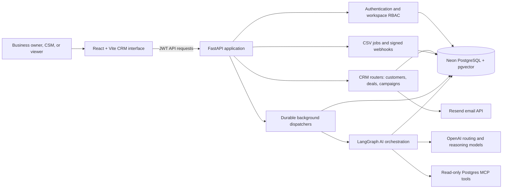
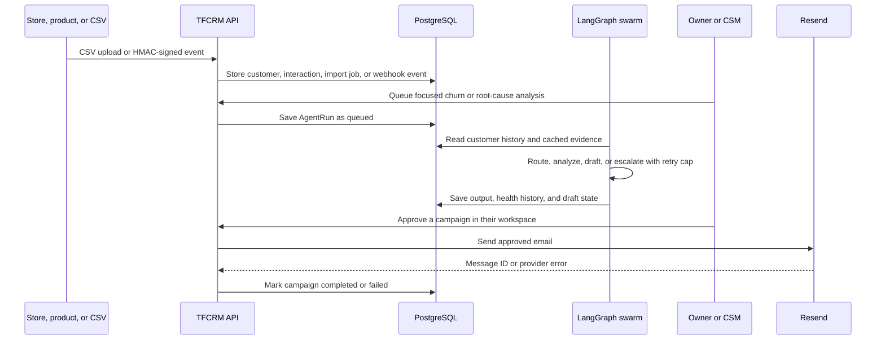
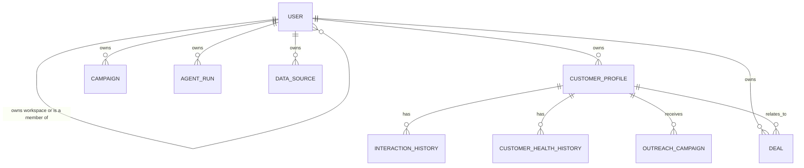
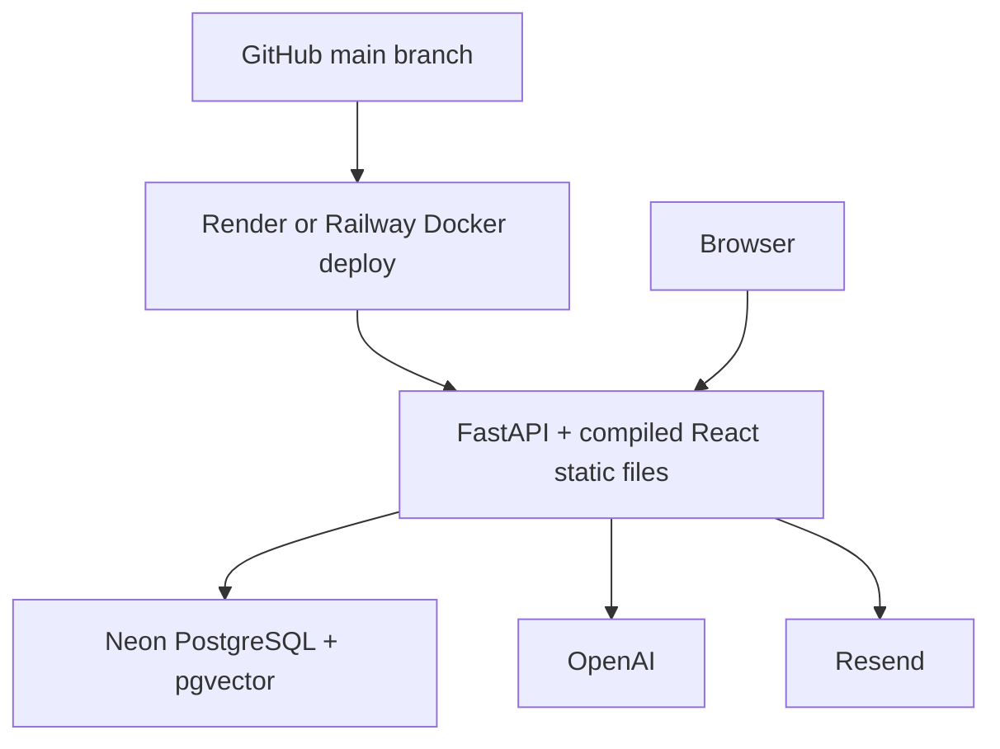

# TFCRM

> **A customer-success CRM that turns scattered customer signals into evidence-based retention work.**

TFCRM gives a business one shared workspace for customers, deals, interactions, product signals, AI-assisted churn analysis, and human-controlled outreach. It is built for teams that need to know which accounts need attention, why, and what to do next without losing the operational discipline of a CRM.

## Elevator Pitch

Most CRMs record customer data. TFCRM also helps a customer-success team act on it.

Import a customer list, connect signed product or commerce events, track deals and interactions, then run a supervised AI analysis on the accounts that matter. The AI only uses stored evidence and approved read-only tools; it creates analysis and draft outreach, while people retain control of delivery. A business owner can dispatch their own approved campaigns, or delegate the work to a Customer Success Manager.

**Best fit:** B2B SaaS, subscription services, agencies, managed-service providers, marketplaces, and product-led businesses with recurring customer relationships.

---

## What A Business Can Do

| Need | TFCRM workflow |
| --- | --- |
| Centralize contacts and account value | Add customers manually or import a CSV with email, phone, MRR, lifetime value, purchase counts, tags, and notes. |
| Keep a pipeline moving | Create deals and move them through New, Contacted, Qualified, Proposal, Closed Won, or Closed Lost. |
| Bring in external activity | Create a signed webhook endpoint for a store, product, form, billing system, or automation service. |
| Spot churn risk | Review health scores and interaction history, then queue a targeted AI analysis. |
| Understand the evidence | Inspect saved agent output, health history, root-cause findings, and recommended next actions. |
| Send outreach safely | Select customers, write or use an AI-assisted draft, review it, and dispatch through Resend. |
| Delegate CRM work | Invite CSMs and viewers into the same private workspace from **Settings**. |

---

## Architecture



### Component Responsibilities

| Component | Responsibility |
| --- | --- |
| **React interface** | CRM screens, live job polling, light/dark theme, role-aware actions, customer selection, campaign creation, and operator review. |
| **FastAPI** | Authenticates requests, scopes data to a workspace, serves the API and production static frontend, and exposes WebSocket agent updates. |
| **Neon PostgreSQL + pgvector** | Stores users, workspaces, customers, interactions, health history, deals, campaigns, data sources, imports, agent runs, and vector data. |
| **Background dispatchers** | Persist and run queued imports and AI jobs even when an operator navigates to another tab. |
| **LangGraph** | Executes guarded routing, cache checks, read-only evidence gathering, root-cause analysis, drafting, and human escalation. |
| **Postgres MCP** | Provides allowlisted read-only database tools for deeper investigation. It must use a separate database identity with `SELECT` only. |
| **Resend** | Delivers only human-approved email using the configured sender identity. |

### Customer Signal To Outreach



---

## Workspace And Roles

Every sign-up creates a private **company workspace**. All customer data, deals, imports, data sources, campaigns, and agent runs belong to that workspace. Team members share the workspace data but not another business's data.

| Role | Scope | Capabilities |
| --- | --- | --- |
| **Platform Admin** | Entire TFCRM platform | View users and workspaces, manage roles, suspend or restore company workspaces, and sign out from the Admin command center. |
| **Company Owner** | Their company workspace | Full CRM access, invitations, integrations, agent runs, campaign creation, approval, and dispatch. No platform-admin approval is required. |
| **CSM** | Their assigned company workspace | Work with customers, deals, integrations, agents, and approve/dispatch company campaigns. |
| **Viewer** | Their assigned company workspace | Inspect dashboard, customers, deals, campaigns, integrations, and agent output without write access. |

### Invite A Team Member

1. Sign in as the **Company Owner**.
2. Open **Settings**.
3. In **Team access**, enter the employee email, username, temporary password, and role.
4. The employee can sign in immediately with their username or email.

Use a CSM for customer-success operators. Use Viewer for leadership, finance, or stakeholders who should see CRM context without changing it.

---

## How To Operate TFCRM

### 1. Create Or Sign In To A Workspace

- New businesses use **Create workspace** to become a Company Owner.
- Users can sign in with either their unique username or email.
- A configured platform admin is created or updated automatically at application startup from `ADMIN_EMAIL`, `ADMIN_USERNAME`, and `ADMIN_PASSWORD`.

### 2. Add Customer Data

Use **Customers** for individual records or **Integrations** for bulk data.

Recommended CSV columns are case-insensitive:

```csv
Company,Email,Phone,MRR,Lifetime Value,Purchase Count,Status,Tags
Northstar Analytics,northstar@example.com,+15550100,2500,15000,8,healthy,"enterprise,analytics"
```

The CSV upload returns immediately as a durable background job. You can change tabs or close the page; its status is saved as `queued`, `running`, `complete`, `failed`, or `cancelled`.

### 3. Add Live Business Signals

In **Integrations**, create either of these endpoints:

- **Store customer events:** upserts customer profile and purchase data from a commerce backend, Zapier, Make, or custom service.
- **Product event webhook:** records application activity, error signals, support events, cancellations, and churn signals in customer history.

Both endpoints require an HMAC-SHA256 signature in `X-TalentForge-Webhook-Signature`. TFCRM stores the generated secret only in the integration configuration. Keep it in the sending system's secret store, never in browser code.

Example request body:

```json
{
  "event_type": "order.paid",
  "payload": {
    "customer": {
      "first_name": "Maya",
      "last_name": "Chen",
      "email": "maya@example.com",
      "total_spent": "842.00",
      "orders_count": 4
    }
  }
}
```

### 4. Work Customers And Deals

- In **Customers**, filter accounts, inspect interaction history, log a call/support/purchase note, and review the health spectrum.
- In **Deals**, create an opportunity and update its stage as work progresses.
- Health scores are a CRM signal, not fabricated customer reviews: `75-100` is positive, `45-74` needs attention, and `0-44` is critical.

### 5. Run AI Analysis

Use **Customers** to select accounts for a focused analysis, or open **Agent Runs** to queue a broader task.

| Agent | Output |
| --- | --- |
| Churn analysis | Updated health signals and retention risk. |
| Root cause | Verified evidence, labeled hypotheses, urgency, risk category, and recommended actions. |
| Outreach draft | A personalized draft for human review; it does not send automatically. |
| Health update | Refreshes health context from recorded CRM activity. |

Agent jobs progress from `queued` to `running` to `complete`, `failed`, or `cancelled`. The dispatcher is database-backed, so changing tabs does not cancel the work. Operators can cancel an active run from **Agent Runs**.

### 6. Approve And Send A Campaign

1. Open **Campaigns** and select customers with valid email addresses.
2. Write the message template and choose **Create draft**.
3. Choose **Ready to dispatch**.
4. A Company Owner or CSM chooses **Approve and dispatch**.
5. TFCRM sends each eligible recipient using Resend in the background.

The campaign is marked `completed` only when all selected recipients were sent successfully. It is marked `failed` if Resend rejects a recipient, the sender setup is invalid, or a selected customer has no email. The sent count remains visible, so partial delivery is never hidden.

---

## AI And Safety Controls

TFCRM is intentionally opinionated about automation:

- **HMAC verification:** telemetry and integration webhooks reject unsigned or invalid requests.
- **Idempotency guard:** duplicate telemetry is blocked per customer, error signature, and hour.
- **Semantic cache:** reuse a closely matching resolution when available to reduce cost and latency.
- **Read-only MCP:** only explicitly allowlisted tools may be called; the MCP database user should have only `CONNECT`, schema `USAGE`, and `SELECT` privileges.
- **Three-retry ceiling:** failed MCP/tool work retries only while `retry_count < max_retries`; at the ceiling it routes to a human escalation node.
- **24-hour outreach cooldown:** prevents repeat automated outreach to the same customer.
- **Human-controlled email:** AI can propose content, but it cannot independently send email.
- **Workspace isolation:** JWT claims are checked against the user’s workspace before CRM records are returned or changed.

---

## Email Delivery: Verified Behavior And Live Test

The Resend adapter has been checked locally with an offline contract test. It verifies that TFCRM:

- refuses to send if `RESEND_API_KEY` or `RESEND_FROM_EMAIL` is missing;
- calls `https://api.resend.com/emails` with a Bearer token;
- sends `from`, an array of `to` recipients, `subject`, and HTML body;
- raises on a non-success provider response; and
- requires Resend to return a message ID.

This check does **not** send a live email or consume Resend quota. A successful live delivery also depends on your Resend account, sender identity, and recipient policy.

### Safe Live Email Test

1. In Resend, confirm that `RESEND_API_KEY` is active.
2. For production, verify a domain and set `RESEND_FROM_EMAIL` to an address on that domain, such as `TFCRM <success@yourdomain.com>`.
3. For Resend’s `onboarding@resend.dev` test sender, use only the email address permitted by your Resend account.
4. Add that permitted address as a customer in TFCRM.
5. Create a one-recipient campaign, choose **Ready to dispatch**, then **Approve and dispatch**.
6. Check the campaign status and sent count in TFCRM, then verify the delivery/activity log in Resend.

Never use `example.com` CSV addresses for a live campaign.

---

## Data Model



Core records include `User`, `CustomerProfile`, `InteractionHistory`, `CustomerHealthHistory`, `Deal`, `Campaign`, `OutreachCampaign`, `AgentRun`, `DataSource`, `ImportJob`, `WebhookEvent`, and `AgentAuditLog`.

---

## Local Setup

### Prerequisites

- Python 3.12
- Node.js 20+
- PostgreSQL/Neon with `pgvector`
- An OpenAI API key for live agents
- A Resend API key for live email

### Configure

```powershell
python -m venv venv
.\venv\Scripts\Activate.ps1
python -m pip install -r requirements.txt
Copy-Item .env.example .env
```

Set the required values in `.env`:

```env
DATABASE_URL=postgresql+asyncpg://...
JWT_SECRET_KEY=at-least-32-random-characters
ADMIN_EMAIL=admin@yourdomain.com
ADMIN_USERNAME=platform-admin
ADMIN_PASSWORD=use-a-long-unique-password
WEBHOOK_SECRET_TOKEN=long-random-webhook-secret
OPENAI_API_KEY=...
RESEND_API_KEY=...
RESEND_FROM_EMAIL=TFCRM <success@yourdomain.com>
```

### Create The Schema And Run

```powershell
alembic upgrade head
uvicorn talentforge.main:app --reload --port 8000
```

In another terminal:

```powershell
cd frontend
npm.cmd install
npm.cmd run dev
```

Open `http://localhost:5173`.

---

## Production Deployment

The repository includes a Dockerfile that builds the Vite frontend and serves it from FastAPI. It is compatible with Render or Railway. Neon provides the database.



Set secrets in the hosting platform, not Git:

- `DATABASE_URL`
- `JWT_SECRET_KEY`
- `ADMIN_EMAIL`, `ADMIN_USERNAME`, `ADMIN_PASSWORD`
- `OPENAI_API_KEY`
- `WEBHOOK_SECRET_TOKEN`
- `RESEND_API_KEY`, `RESEND_FROM_EMAIL`
- `POSTGRES_MCP_URL`, `POSTGRES_MCP_AUTH_TOKEN`, and tool allowlist values when MCP is enabled
- `FRONTEND_URL` to the deployed browser origin

The container runs `alembic upgrade head` before starting FastAPI. Do not put any production secrets in `.env.example`, frontend `VITE_*` values, commits, or screenshots.

---

## Verification Checklist

Run the automated checks:

```powershell
.\venv\Scripts\python.exe -m pytest tests
cd frontend
npm.cmd run build
```

Before a demo, verify:

- A Company Owner can sign up, import a CSV, create a customer, create a deal, and invite a CSM.
- A Viewer can inspect workspace data but cannot perform write actions.
- A CSM can sign in and approve a workspace campaign.
- A Company Owner can approve and dispatch their own campaign without platform-admin involvement.
- The platform Admin can view users/workspaces, suspend and restore a workspace, refresh data, and sign out.
- A signed webhook creates a customer interaction or updates a commerce customer.
- One permitted Resend test recipient receives an approved campaign.

---

## Main API Areas

| API area | Purpose |
| --- | --- |
| `/auth` | Sign-up, username/email login, profile updates, JWT issuance. |
| `/api/customers` | Customers, health history, interactions, and risk scoring. |
| `/api/deals` | Workspace-scoped deal pipeline. |
| `/api/agents` | Durable AI runs, output inspection, and cancellation. |
| `/api/campaigns` | Campaign drafts, approval, dispatch, and agent-generated review campaigns. |
| `/api/integrations` | CSV jobs, signed webhooks, commerce sync, and MCP registration metadata. |
| `/api/team` | Company-owner invitations and team-role management. |
| `/api/admin` | Platform-wide user and workspace operations. |
| `/api/telemetry/event` | Secure telemetry ingestion with HMAC and idempotency checks. |
| `/ws/agent/stream/{session_id}` | Live agent trace stream for authenticated sessions. |

## License

Hackathon project. Configure your own service accounts and comply with the privacy, retention, consent, and marketing-email requirements that apply to your business.
