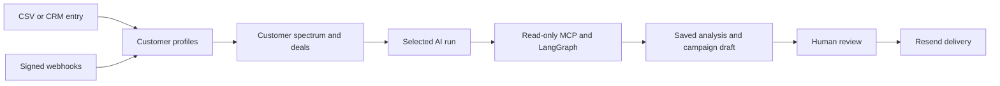

# TalentForge CRM

TalentForge is a customer-success CRM for teams that need to keep customer data, deal progress, product signals, AI analysis, and outreach approval in one place. It combines everyday CRM work with guarded AI assistance for churn detection and customer follow-up.

The AI never sends customer email on its own. It can analyze selected customers, summarize evidence, draft outreach, and queue campaigns, but a CSM or Admin must approve delivery.

## What It Does

- Store customers, email, phone, MRR, lifetime value, purchase count, health scores, tags, notes, and interaction history.
- Import customer lists from CSV files.
- Maintain a sales/customer-success deal pipeline.
- Receive signed product events through webhooks.
- Run AI churn, root-cause, outreach, and health-score jobs.
- Show selected customers on a positive-to-critical health spectrum with evidence from interaction history.
- Create outreach campaigns and require human approval before Resend sends them.
- Keep AI database access read-only through Postgres MCP.

## Who It Helps Most

TalentForge is most useful for businesses with recurring customer relationships and usable product/customer data:

- B2B SaaS companies tracking logins, errors, usage drops, renewals, and support issues.
- Subscription businesses that need early warning before churn or cancellation.
- Agencies and managed-service teams handling many client accounts and renewal conversations.
- Marketplaces and platforms with account managers, customer success teams, or vendor success teams.
- Product-led businesses that can send customer activity or support signals through webhooks.

It is less useful for one-time retail sales, businesses with no customer contact data, or teams that do not have a human available to review customer communication.

## Roles

| Role | What it can do |
| --- | --- |
| Company user | Manage its own customers, deals, integrations, agent runs, and campaign drafts. Can request campaign review. |
| CSM | Review and approve human-review outreach campaigns. |
| Admin | Has CSM review rights plus the Admin screen for system/company oversight. |

New sign-ups are Company users. Create the initial Admin account with `ADMIN_EMAIL` and `ADMIN_PASSWORD`, then run `python -m talentforge.seed_admin`.

New accounts choose a unique username. They can sign in with either that username or their email. Existing accounts can continue signing in with email; set `ADMIN_USERNAME` and rerun the seed command to give the Admin account a username too.

## Daily Operation

### 1. Add customers

Use **Customers** to add one customer manually, or use **Integrations -> CSV import** to add a list.

The importer accepts these headers (case-insensitive):

```csv
Company,Email,Phone,MRR,Lifetime Value,Purchase Count,Status,Tags
Northstar Analytics,northstar@example.com,+15550100,2500,15000,8,healthy,"enterprise,analytics"
```

Use [test_customers.csv](test_customers.csv) for a safe starter import. Its `example.com` email addresses are placeholders, so do not approve delivery to them.

Use [background_import_customers.csv](background_import_customers.csv) to test a multi-row background import with email, phone, MRR, lifetime value, and purchase-count data.

### 2. Review customer health and feedback

On **Customers**:

1. Tick one or more customer checkboxes.
2. Read the **Customer feedback spectrum** cards.
3. Use **Run analysis** to queue a focused churn-analysis run for only those customers.
4. Open **Agent Runs** and click the completed run to inspect updated scores, reasons, root causes, or recommended actions.

The star rating is a visualization of the saved health score, not a fabricated review score:

| Health score | Spectrum | Rating |
| --- | --- | --- |
| 75-100 | Positive | 4-5 stars |
| 45-74 | Watch | 3-4 stars |
| 0-44 | Critical | 1-3 stars |

The cards display real health-history reasons and the latest stored interaction payloads. Those interactions are created from telemetry/webhooks and other connected data; if there are no interactions, TalentForge says so rather than inventing feedback.

Open **Inspect** on a customer to add a CRM note, call summary, customer email, purchase, or support-ticket interaction. It is saved as evidence for later analysis. This lets teams record live customer context even when it did not arrive through an integration.

### 3. Manage deals

Open **Deals** and choose a customer, deal name, and value. Move each deal through:

`New lead -> Contacted -> Qualified -> Proposal -> Closed won / Closed lost`

Deals are scoped to the signed-in company. A user cannot see or edit another company's deals.

### 4. Run AI agents

Open **Agent Runs** to start a general run, or select customers from **Customers** for a focused churn analysis.

Available agents:

- **Churn scorer:** recalculates selected customer health scores and records the reason.
- **Root cause analyst:** examines scoped CRM history, interaction records, and permitted read-only MCP data for evidence-bound causes and actions.
- **Outreach drafter:** creates a campaign draft for human review; it does not send email.
- **Health updater:** recalculates health using recorded CRM activity volume.

### What `queued` means

When you click **Run analysis**, TalentForge immediately saves an `AgentRun` with status `queued` and returns control to the browser. A database-backed dispatcher then claims the job and starts it in the background:

`queued -> running -> complete` or `failed`

The Agent Runs page refreshes every five seconds. Click a run to see its output. A queued job can take longer when the server is busy, the model is processing a large selection, or the read-only MCP service is slow. A failed job stores a safe generic failure message; it does not expose secrets or database credentials.

Queued jobs are recovered after an API restart, so a development reload does not leave them stranded. For production scale, run the API with sufficient worker capacity or move background execution to a dedicated queue worker.

Each job has a configurable 180-second overall timeout (`TALENTFORGE_AGENT_RUN_TIMEOUT_SECONDS`). A slow job keeps running in the background while you navigate; if it exceeds that limit, it becomes `failed` with a safe retry message instead of appearing stuck forever.

### 5. Create and send a campaign

1. Go to **Campaigns**.
2. Create a campaign draft with a message template and select one or more customers with valid contact emails.
3. Click **Request review**. The status becomes `pending_review`.
4. A CSM or Admin signs in, opens Campaigns, then chooses **Approve & dispatch**.
5. TalentForge sends the approved message through Resend and updates campaign status.

Company users can create and request review, but cannot bypass approval. If a campaign recipient has no contact email, delivery is rejected and the campaign remains available for correction.

For `RESEND_FROM_EMAIL=onboarding@resend.dev`, Resend test-mode delivery is normally limited to the account owner's email. Verify a domain in Resend before sending real customer campaigns.

## Integrations

Integrations do not magically discover or fetch data from every tool. Each option has a specific job.

### CSV import

You upload a customer CSV manually. TalentForge persists it as an import job, then processes rows in the background. You can change tabs or return later; the Integrations page polls and shows queued, running, complete, or failed status with imported/skipped rows.

### Webhook source

Click **Create webhook** to generate a unique secret. Configure your product, website form handler, support system, or billing system to call:

```text
POST /api/integrations/webhook/{company_id}
```

Include the `X-TalentForge-Webhook-Signature` header containing the HMAC-SHA256 signature of the raw request body using that generated secret. Supported event types are:

- `user.login`
- `user.churn_signal`
- `subscription.cancelled`
- `support.ticket.opened`

For churn or cancellation events, TalentForge marks the referenced customer as at risk, reduces the health score, and writes health history. This is how external activity becomes visible in the CRM.

### MCP connector

The connector form records an approved MCP connection in the CRM for operational visibility. The live AI graph uses the server configured through `POSTGRES_MCP_*` environment variables. Configure those variables with a separate, read-only database identity; do not provide the main application database password to MCP.

The MCP layer is restricted to approved read-only tools. It must not insert, update, delete, or change database schema.

## Profile and Admin Operations

### Profile settings

Every signed-in user has **Settings** in the sidebar. It can update the workspace name, sign-in email, and password. Changing a password requires the current password and a new password of at least 12 characters.

### Admin command center

Admins have an **Admin** sidebar page. It shows all registered users, company workspaces, customer counts, campaign counts, agent runs, and recorded usage. An Admin can change a user role or suspend a company workspace. Suspension prevents future authenticated access for that company user.

## AI Safety Guards

- Telemetry uses HMAC-SHA256 request signatures.
- Duplicate telemetry is blocked per customer/error/hour using an idempotency key.
- Semantic cache can reuse a prior resolution to reduce model calls.
- Customer outreach has a 24-hour cooldown.
- MCP tools are read-only and restricted by an allowlist.
- Tool retries are capped at three; repeated failure escalates to a human fallback instead of looping.
- Every customer email requires human approval.

## Local Setup

### 1. Install backend dependencies

```powershell
python -m venv venv
.\venv\Scripts\Activate.ps1
python -m pip install -r requirements.txt
```

### 2. Configure `.env`

Copy `.env.example` to `.env`, then set at least:

```env
DATABASE_URL=postgresql+asyncpg://...
JWT_SECRET_KEY=at-least-32-random-characters
ADMIN_EMAIL=admin@yourdomain.com
ADMIN_PASSWORD=a-strong-password-with-at-least-12-characters
WEBHOOK_SECRET_TOKEN=a-strong-shared-webhook-secret
OPENAI_API_KEY=...
RESEND_API_KEY=...
RESEND_FROM_EMAIL=onboarding@resend.dev
```

Use a valid email domain for `ADMIN_EMAIL`; values ending in `.local` are rejected by authentication validation.

### 3. Create schema and Admin account

```powershell
alembic upgrade head
python -m talentforge.seed_admin
```

### 4. Run locally

Backend, from project root:

```powershell
uvicorn talentforge.main:app --reload --port 8000
```

Frontend, in a second terminal:

```powershell
cd frontend
npm.cmd install
npm.cmd run dev
```

Open `http://localhost:5173`. Use this Vite URL during development, not the backend URL.

## Hackathon Deployment

Use the lowest-cost production split:

- **Vercel Hobby:** React frontend from the `frontend` folder.
- **Render Free:** FastAPI Docker backend using `render.yaml`.
- **Neon Free:** PostgreSQL with `pgvector`.
- **Resend:** outbound email after a human approves a campaign.

See [DEPLOYMENT.md](DEPLOYMENT.md) for the full runbook. The important rule is that only public frontend config goes into Vercel. Backend secrets such as `DATABASE_URL`, `OPENAI_API_KEY`, `JWT_SECRET_KEY`, `WEBHOOK_SECRET_TOKEN`, `RESEND_API_KEY`, and `POSTGRES_MCP_AUTH_TOKEN` must be stored only in Render/Railway/GitHub secret settings.

Production environment mapping:

| Host | Required config |
| --- | --- |
| Vercel frontend | `VITE_API_URL=https://your-backend-host.example.com` |
| Render/Railway backend | `.env.example` values, entered as platform secrets |
| Neon database | App `DATABASE_URL` plus separate read-only MCP database user |
| GitHub Actions | Optional Docker/Render deploy secrets only; tests and Docker build run without production secrets |

The Docker container runs `alembic upgrade head` before starting FastAPI, so database migrations are applied during deployment. The included `.dockerignore` blocks local `.env` files from entering Docker build context.

## Verification

```powershell
.\venv\Scripts\python.exe -m pytest tests
cd frontend
npm.cmd run build
```

## Architecture



## Main API Areas

- `/auth`: sign-up and JWT login.
- `/api/customers`: customer records, health history, interactions, and risk scoring.
- `/api/deals`: company-scoped deal pipeline.
- `/api/agents`: background AI runs and their saved output.
- `/api/campaigns`: drafts, review requests, approval, and delivery.
- `/api/integrations`: CSV imports, webhook sources, and MCP registry records.
- `/api/telemetry/event`: secure platform telemetry ingestion.
