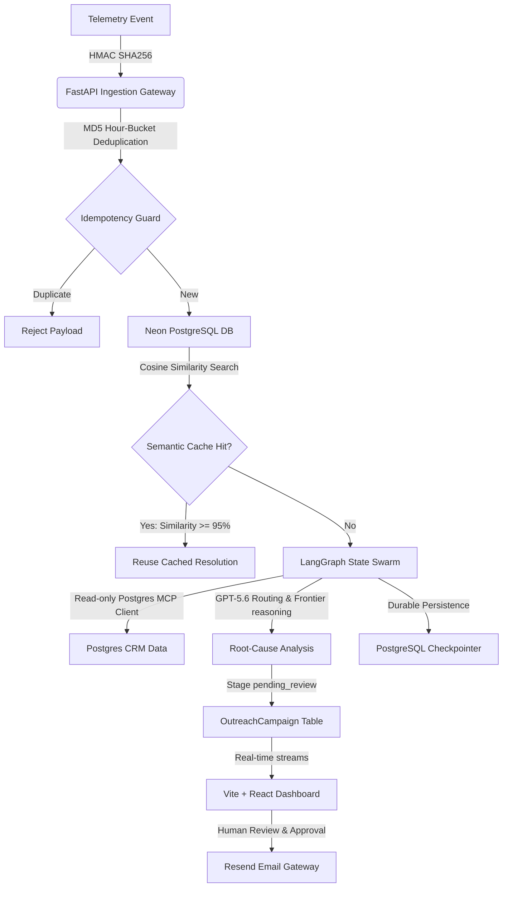

# TalentForge – The Autonomous Customer Success & Churn Mitigation Hub

TalentForge is a production-grade, loop-guarded, autonomous customer success and churn mitigation hub. It ingests platform telemetry events, evaluates them against a high-speed semantic cache using pgvector, queries read-only data tools via a secure Model Context Protocol (MCP) gateway, reasons over incident context using a tiered LangGraph state machine, streams live traces in real-time via WebSockets, and stages tailored customer outreach drafts in a dashboard for mandatory human review and delivery via Resend.

---

## 🏗️ Architectural Topology



### 1. Telemetry Ingestion Layer (`ingestion.py`)
*   **Security Signature Gate**: Validates incoming telemetry via HMAC-SHA256 signature calculated against a shared webhook token (`X-TalentForge-Signature`).
*   **Feedback-Loop Protection**: Calculates a deterministic MD5 hash of `customer_id + error_signature + current_hour_timestamp` (`TelemetryIngestionDeduplication`). Duplicate payloads within the same hour window are instantly rejected (HTTP 409 Conflict) to avoid triggering infinite automated agent runs.

### 2. Semantic Caching Engine (`db/cache_service.py`)
*   **pgvector Similarity Lookup**: Translates incoming telemetry alert embeddings into a high-speed hybrid RAG lookup.
*   **Cosine Distance calculations**: Distance is computed as `1.0 - Cosine Similarity`. If an alert matches a previously resolved incident with similarity $\ge 95\%$ (distance $\le 0.05$), the resolved draft payload is reused instantly, bypassing the expensive LLM graph.
*   **Customer Cooldown Gate**: Checks for any `OutreachCampaign` staged for the customer within the last 24 hours to prevent spamming accounts.

### 3. LangGraph Multi-Agent Swarm (`graph_engine.py` & `mcp_client.py`)
*   **State Machine Engine**: Compiles a durable, asynchronous state graph with nodes for caching checks, read-only MCP tool extraction, root-cause reasoning, drafting, and human escalation.
*   **Three-Retry Ceiling Guard**: Increments retry counts on any Postgres MCP tool discovery, connection, or timeout failure. If `retry_count >= 3`, the engine immediately exits the automated loop and transitions to `escalate_to_human_node` to stage a safe baseline tracking log.
*   **MCP Read-Only Client**: Wraps Remote MCP Servers through `langchain-mcp-adapters`. It parses remote tools and automatically rejects any mutating tool commands (e.g. `insert`, `update`, `drop`) to protect the database.

### 4. Interactive Command Center (`frontend/`)
*   **Real-time Timeline Tracking (`AgentMonitor.jsx`)**: Establishes a native WebSocket connection pointing to `/ws/agent/stream/{session_id}`. It renders real-time trace events (node entries, tool calls, retries) as animated, pulsing status dots.
*   **Human-in-the-Loop approval**: Staged drafts are editable. Reviewers click "Approve & Dispatch Outreach" (which updates the database status and dispatches the email via the Resend API gateway) or "Reject / Redraft".

---

## 🛠️ Step-by-Step Installation & Setup

### 1. Python Backend Installation
Create a virtual environment and install the required modules:
```powershell
# Create virtual environment
python -m venv venv
venv\Scripts\Activate.ps1

# Install requirements
pip install -r requirements.txt
```

### 2. Configure Environment Variables
Copy `.env.example` to `.env` and fill in your developer keys:
```powershell
copy .env.example .env
```
*Make sure to configure:*
*   `DATABASE_URL`: Neon PostgreSQL connection string.
*   `JWT_SECRET_KEY`: A secure 32+ character random string.
*   `TALENTFORGE_WEBHOOK_SECRET`: Secret shared token with telemetry broadcasters.
*   `OPENAI_API_KEY`: API Key for model invocations.
*   `RESEND_API_KEY`: Resend Developer API key.

### 3. Run Database Migrations
Initialize database schemas and compile the read-only privileges:
```powershell
# Run alembic migrations
alembic upgrade head
```

### 4. Frontend Installation
Set up the Vite React client:
```powershell
cd frontend
npm install
```

---

## 🚀 Running the Application Local Servers

1.  **Start the Backend API Server**:
    ```powershell
    # From the project root
    uvicorn talentforge.main:app --reload --port 8000
    ```
2.  **Start the Frontend Dashboard**:
    ```powershell
    # From the frontend directory
    npm run dev
    ```

---

## 🧪 Testing & Verification Playbook

### 1. Running Pytest Suite
Run the automated unit and integration tests (auth logic, signature validation, hourly deduplication, and LangGraph 3-retry loops):
```powershell
# Installs testing packages
pip install pytest pytest-asyncio anyio httpx aiosqlite

# Execute tests
python -m pytest -v
```

### 2. Testing Telemetry Webhook Ingestion (HMAC-SHA256)
To verify the telemetry gateway is secure, you can send an HTTP POST event with an HMAC-SHA256 signature.

Create a test payload `event.json`:
```json
{
  "customer_id": "8a3d537f-3106-4444-9999-555555555555",
  "event_type": "metrics.exception",
  "error_signature": "NullPointerException: auth_service.py line 44",
  "payload": {
    "module": "auth_service",
    "traceback": "Unexpected NoneType during user context lookup"
  }
}
```

Calculate the HMAC-SHA256 signature in PowerShell:
```powershell
$secret = "replace-with-strong-shared-webhook-secret" # Must match .env TALENTFORGE_WEBHOOK_SECRET
$body = Get-Content -Raw event.json
$hmac = New-Object System.Security.Cryptography.HMACSHA256
$hmac.Key = [System.Text.Encoding]::UTF8.GetBytes($secret)
$signatureBytes = $hmac.ComputeHash([System.Text.Encoding]::UTF8.GetBytes($body))
$signature = [System.BitConverter]::ToString($signatureBytes).Replace("-", "").ToLower()
Write-Host "X-TalentForge-Signature: sha256=$signature"
```

Submit via `curl` to the ingestion API:
```powershell
curl -X POST http://localhost:8000/api/telemetry/event `
  -H "Content-Type: application/json" `
  -H "X-TalentForge-Signature: sha256=<CALCULATED_SIGNATURE_HERE>" `
  -d @event.json
```

### 3. Testing WebSocket live monitoring
1.  Open the frontend dashboard at `http://localhost:5173`.
2.  Select an active customer card under the review queue.
3.  Simulate a telemetry exception. Watch the **AgentMonitor** timeline update with real-time logs and animated node entries as the graph runs.
4.  Once the state completes, inspect the staged email draft in the review panel, edit the text, and click **Approve & Dispatch Outreach** to trigger the Resend email service.
