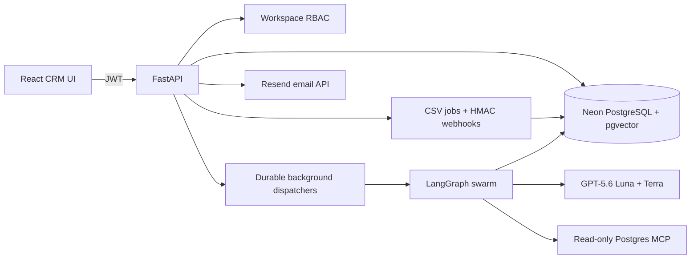
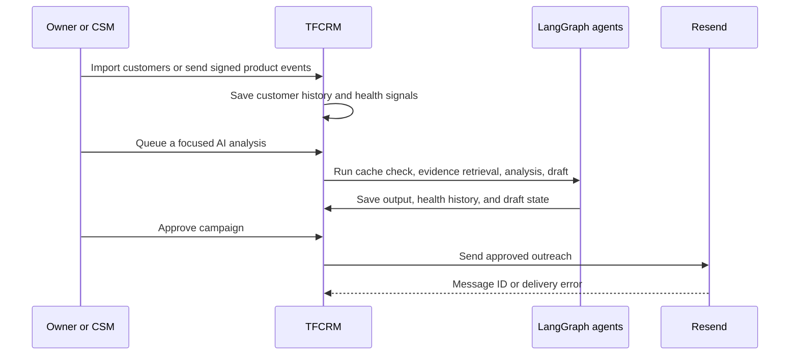

# TFCRM

> **An AI customer-success CRM that turns customer signals into safe, evidence-based retention actions.**

[Open the live demo](https://talentforge-api-ty00.onrender.com/) | **Hackathon track:** Work and productivity

TFCRM brings customer records, deals, product activity, AI churn analysis, and human-approved outreach into one workspace. A team can see which customers need attention, investigate why with evidence, and take action without granting AI unsafe database or email autonomy.

## Judge Fast Path

1. Open the [live demo](https://talentforge-api-ty00.onrender.com/).
2. Sign in with the demo workspace:

   ```text
   Username: test_user
   Email: test_user@11
   Password: qwertyuiop1234
   ```

3. Open **Customers** to inspect health signals and interaction history.
4. Open **Agent Runs** to view durable AI work and outputs.
5. Open **Campaigns** to see the human-reviewed outreach workflow.
6. Open **Integrations** to inspect CSV import jobs and signed webhook setup.

The account contains demonstration data only. Do not enter sensitive customer information or approve a campaign to an address you do not control.

## Why TFCRM

Most CRMs store customer data. TFCRM helps a customer-success team act on it.

- Import customer lists or connect product/commerce events.
- Track deals, account value, health, interaction history, and risk signals in one private workspace.
- Run supervised AI analysis for churn risk, root cause, outreach drafts, and health scoring.
- Keep every email under human control: a Company Owner or CSM must explicitly approve dispatch.
- Give teams shared access with owner, CSM, viewer, and platform-admin roles.

**Best for:** B2B SaaS, subscriptions, agencies, managed-service teams, marketplaces, and product-led businesses with recurring customer relationships.

## Architecture



### Core Flow



## Features

| Area | What it does |
| --- | --- |
| Customers | Stores contacts, email, phone, MRR, value, purchases, notes, tags, health, and interactions. |
| Deals | Tracks opportunities from New through Closed Won or Closed Lost. |
| Integrations | Imports CSV data in the background and creates signed product or commerce webhook endpoints. |
| AI agents | Runs churn analysis, root-cause analysis, outreach drafting, and health updates as durable background jobs. |
| Campaigns | Selects recipients, creates drafts, records approvals, and sends through Resend. |
| Team access | Lets Company Owners invite CSMs and read-only Viewers into the same workspace. |
| Admin | Lets the platform admin inspect users/workspaces and suspend or restore a workspace. |

### Roles

| Role | Permissions |
| --- | --- |
| Platform Admin | Cross-platform user/workspace oversight, suspend/restore, admin dashboard. |
| Company Owner | Full access to their private CRM workspace, invitations, approvals, and delivery. |
| CSM | Operates CRM workflows and can approve/dispatch outreach for its workspace. |
| Viewer | Reads shared workspace data without write access. |

## AI And Safety

TFCRM is designed for assisted operations, not unsupervised automation.

- HMAC-SHA256 validates telemetry and integration webhooks.
- Hourly idempotency keys block duplicate error ingestion loops.
- Semantic caching reduces repeat model work.
- MCP tools are allowlisted and read-only.
- Tool retry count is capped at three; failures escalate to a human fallback.
- Customer outreach observes a 24-hour cooldown window.
- AI drafts; a person approves email delivery.
- JWT workspace checks isolate each company’s CRM records.

## Built With Codex And GPT-5.6

This project was built iteratively with Codex as the implementation partner.

| Area | How Codex accelerated it |
| --- | --- |
| Backend | Generated and refined FastAPI routers, SQLModel models, Alembic migrations, JWT/RBAC guards, background dispatchers, webhook handling, and Resend integration. |
| AI system | Helped build the LangGraph state machine, retry/escalation guards, MCP client boundary, agent prompts, and durable checkpoint approach. |
| Frontend | Built the Vite/React CRM interface, responsive navigation, theme support, customer/agent/campaign workflows, loading/cancellation states, and error fixes. |
| Reliability | Traced production build failures, React event-lifecycle bugs, background-job behavior, and added focused automated tests. |
| Product decisions | Helped translate CRM workflows into workspace ownership, internal CSM/viewer roles, explicit campaign approval, and readable operator documentation. |

### GPT-5.6 Usage

- **GPT-5.6 Luna:** fast routing, tool-selection, and formatting passes.
- **GPT-5.6 Terra:** deeper root-cause reasoning and empathetic outreach drafting.
- **Codex:** converted the architecture into a working full-stack product, debugged it iteratively, and supported deployment readiness.

## Local Setup

### Prerequisites

Python 3.12, Node.js 20+, PostgreSQL/Neon with `pgvector`, an OpenAI API key for live agents, and a Resend API key for live email.

```powershell
python -m venv venv
.\venv\Scripts\Activate.ps1
python -m pip install -r requirements.txt
Copy-Item .env.example .env
alembic upgrade head
uvicorn talentforge.main:app --reload --port 8000
```

In another terminal:

```powershell
cd frontend
npm.cmd install
npm.cmd run dev
```

Open `http://localhost:5173`.

Required backend configuration:

```env
DATABASE_URL=postgresql+asyncpg://...
JWT_SECRET_KEY=at-least-32-random-characters
OPENAI_API_KEY=...
WEBHOOK_SECRET_TOKEN=long-random-secret
RESEND_API_KEY=...
RESEND_FROM_EMAIL=TFCRM <success@yourdomain.com>
ADMIN_EMAIL=admin@yourdomain.com
ADMIN_USERNAME=platform-admin
ADMIN_PASSWORD=long-unique-password
```

## Testing

```powershell
.\venv\Scripts\python.exe -m pytest tests
cd frontend
npm.cmd run build
```

For a safe Resend test, use a single recipient address permitted by your Resend account. `onboarding@resend.dev` is restricted by Resend; use a verified sender domain for real customer outreach.

Sample imports: [test_customers.csv](test_customers.csv) and [background_import_customers.csv](background_import_customers.csv).

## Deployment

The Docker image builds the React frontend and serves it from FastAPI. The intended production stack is:

- **Render/Railway:** FastAPI + compiled React assets
- **Neon:** PostgreSQL and pgvector
- **OpenAI:** GPT-5.6-backed agent reasoning
- **Resend:** approved outbound email

Store all secrets only in hosting-platform environment variables. Never commit `.env`, database URLs, OpenAI keys, Resend keys, webhook secrets, or MCP tokens.

## API Map

| Endpoint group | Purpose |
| --- | --- |
| `/auth` | Sign-up, username/email login, profile, JWT. |
| `/api/customers` | Customers, health history, interactions, risk scoring. |
| `/api/deals` | Deal pipeline. |
| `/api/agents` | Durable AI runs, output inspection, cancellation. |
| `/api/campaigns` | Drafts, approval, dispatch. |
| `/api/integrations` | CSV jobs, webhooks, commerce sync. |
| `/api/team` | Owner-managed workspace members. |
| `/api/admin` | Platform-admin operations. |
| `/ws/agent/stream/{session_id}` | Agent trace stream. |

## Hackathon Submission Notes

- **Track:** Work and productivity
- **Live project:** [https://talentforge-api-ty00.onrender.com/](https://talentforge-api-ty00.onrender.com/)
- **Repository:** include this GitHub repository URL in the submission.
- **Demo video:** show the Judge Fast Path, then explain the Codex and GPT-5.6 sections above in under three minutes.
- **Codex feedback:** submit the `/feedback` Session ID from the main build thread in the Devpost form.

## License

Released under the [MIT License](LICENSE).
